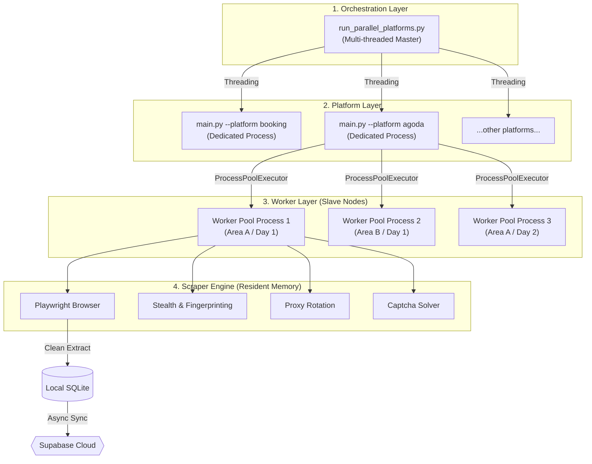

# Pahang Hotel Revenue Intelligence & Compliance Suite

> **File Date**: April 8, 2026  
> **Version**: 2.0.0

A modular, automated auditing system built with **Python**, **Playwright**, and **Dash** to monitor hotel inventory and identify tax leakage by comparing OTA data (Agoda, Booking.com, Airbnb, Traveloka) against official government declarations.

## 🚀 Key Features

- **Multi-Platform Stealth Scraping**: Robust extraction from Agoda, Booking.com, Airbnb, and Traveloka using `playwright-stealth` and dynamic browser fingerprinting.
- **Advanced Anti-Detection**: Canvas/WebGL/Audio fingerprinting, TLS fingerprinting, IFrame blocking, and performance timing randomization.
- **CAPTCHA Bypass**: Multi-provider support (2Captcha, Capsolver, Anti-Captcha, CapMonster) with automatic detection and solving.
- **Cloudflare Bypass**: Integrated Flaresolverr support for Cloudflare challenge handling.
- **Revenue Audit Dashboard**: High-performance dashboard capable of handling 1,000,000+ records with server-side filtering and parallel fetching.
- **Intelligent Pickup Detection**: Analyzes inventory changes between scrapes to detect sold nights ("pickups") and estimate actual revenue.
- **Fuzzy Data Linking**: Intelligent name matching to connect scraped OTA records with official state registration files.
- **Enforcement Prioritization**: Automatically flags "Critical" and "High Risk" properties with significant reporting gaps.
- **Industrial Deployment**: Powered by **Gunicorn** with multi-worker/multi-thread support for stable production serving.

---

## 🛠 Project Structure

```text
hotel/
├── main.py              # The "Brain": Orchestrates all scrapers and orchestrates tasks
├── dashboard.py         # The "UI": High-performance Dash application with Gunicorn support
├── scrapers/            # The "Workers": Platform-specific scraping logic (Agoda, Booking, etc.)
├── utils/               # The "Core": Database utilities (Supabase/SQLite) and stealth helpers
├── scripts/             # The "Utilities": Deployment (up.sh, bash_domain.sh) and analysis tools
├── data/                # The "Vault": Local SQLite storage and official CSV registries
├── configs/             # The "Settings": Locations, holidays, and system configurations
├── logs/                # The "Eyes": Traceable logs for scrapers and dashboard
└── docs/                # The "Library": System specifications and presentation guides
```

---

## 📥 Setup & Installation

Ensure you have Python 3.10+ installed.

```bash
# 1. Create and activate virtual environment
python3 -m venv venv
source venv/bin/activate

# 2. Install required packages (includes Gunicorn and Stealth libs)
pip install -r requirements.txt

# 3. Install Playwright browser engines
playwright install chromium
```

---

## 🖥 Usage

### 1. Execute Scrapers
To capture real-time market data across all configured areas with stealth mode enabled:

```bash
# Full week pickup sequence (7 days with dynamic stay duration)
./venv/bin/python3 main.py --week --stealth
```

### 2. Launch Dashboard
For production environments, use the unified startup script which handles Gunicorn workers, fuser cleanup, and Cloudflare tunnels:

```bash
cd scripts/
bash up.sh --force
```

> **Note:** Running `up.sh --force` will also trigger `analyze_pickup.py --days 7` to analyze pickup trends automatically.

---

## 📊 Dashboard Intelligence

### Performance Optimizations
- **Server-Side Filtering**: Defaults to a 7-day data window on initial load to handle massive datasets (350k+ records) with near-zero lag.
- **Parallel Fetching**: Uses `ThreadPoolExecutor` to fetch snapshots and pickups simultaneously.
- **Memory Compression**: Implements Categorical data types to reduce RAM usage by 80%.

### Compliance Modules
- **Revenue Audit Matrix**: Compares detected supply against `property_registration.csv`.
- **Enforcement Priority**: Risk-ranked list mapping compliance gaps.
- **Platform Analytics**: Market share and capacity breakdown.

---

## 📋 Data Architecture

### Data Flow
```
Scrapers → SQLite → Async background sync → Supabase (cloud)
                              ↓
                    Dashboard reads SQLite (primary)
                              ↓
                    Falls back to Supabase if unavailable
```

**Sync Behavior:**
- New records are saved to SQLite first
- Immediately queued for async background sync to Supabase
- Sync runs in background thread (non-blocking)
- Falls back to SQLite for dashboard queries

| Table | Purpose |
| :--- | :--- |
| **snapshots** | Full inventory logs for specific stay dates (SQLite primary, Supabase backup). |
| **pickup_trends** | Daily detected sold nights and estimated revenue. |
| **sync_audit** | Tracking logs for data synchronization between local and cloud. |

---

## 🤖 Scraper Worker Architecture

The system uses a hierarchical parallel processing model to maximize throughput while maintaining anti-detection stability.



### Worker Logic Flow
1.  **Master Orchestrator**: Launches separate OS processes for each OTA platform (Agoda, Booking, etc.) to ensure memory isolation.
2.  **Platform Master**: Creates a `ProcessPoolExecutor` (Slave Pool) based on the `--workers` count. It chunks the task list (Location × Date × Stay Duration).
3.  **Slave Worker**: 
    - Initializes a fresh Playwright browser context with randomized fingerprints.
    - Routes traffic through a proxy rotation logic.
    - Executes the platform-specific extraction script.
    - Handles any interactive CAPTCHA challenges via external API solvers.
4.  **Data Persistence**: Workers write results to a local WAL-mode SQLite database immediately, which is then mirrored to Supabase using a non-blocking background thread.

---

## 🛡 Stealth & Anti-Detection
The system utilizes a multi-layered defense strategy:

### Core Stealth Features
1. **Playwright Stealth**: Bypasses common headless detection signatures.
2. **Fake-UserAgent**: Randomized, realistic browser identities.
3. **Dynamic Headers**: Aligns `sec-ch-ua` and `sec-ch-ua-platform` with the randomized identity.
4. **Randomized Delays**: Variable sleep patterns to mimic human browsing behavior.

### Advanced Anti-Detection (v2.0+)
| Feature | Description |
|---------|-------------|
| **Canvas Fingerprinting** | Adds random noise to canvas `getImageData()` to prevent fingerprinting |
| **WebGL Spoofing** | Masks WebGL renderer/vendor info with randomized GPU signatures |
| **Audio Context Noise** | Adds subtle distortion to AudioContext fingerprinting |
| **IFrame Blocking** | Prevents tracking IFrames from detecting headless browsers |
| **Performance Timing** | Randomizes `performance.now()` and blocks longtask monitoring |
| **Connection Spoofing** | Mocks Network Information API (`effectiveType`, `downlink`, `rtt`) |
| **Worker/Blob Spoofing** | Blocks/limits Web Workers and Blob URLs used for detection |
| **Hardware Spoofing** | Randomized `deviceMemory`, `hardwareConcurrency`, `platform` |
| **TLS Fingerprinting** | Supports curl-cffi for Chrome/Firefox TLS signatures |

### Browser Fingerprint Randomization
The `BrowserFingerprint` class generates unique fingerprints per session:
- **Platform**: Win32, MacIntel, Linux x86_64
- **WebGL Vendor/Renderer**: Intel, NVIDIA, AMD, Apple
- **Hardware**: Random deviceMemory (2-16GB) and core count (2-16)
- **Viewport**: 720p to 1440p randomized

---

## 🔐 CAPTCHA & Cloudflare Bypass

### Supported CAPTCHA Providers
| Provider | Environment Variable | Website |
|----------|---------------------|---------|
| **2Captcha** | `2CAPTCHA_KEY` or `CAPTCHA_API_KEY` | [2captcha.com](https://2captcha.com) |
| **Capsolver** | `CAPSOLVER_KEY` | [capsolver.com](https://capsolver.com) |
| **Anti-Captcha** | `ANTICAPTCHA_KEY` | [anti-captcha.com](https://anti-captcha.com) |
| **CapMonster** | `CAPMONSTER_KEY` | [capmonster.cloud](https://capmonster.cloud) |

### Supported CAPTCHA Types
- reCAPTCHA v2 (checkbox)
- reCAPTCHA v3 (invisible)
- hCaptcha
- Cloudflare Turnstile
- Image CAPTCHA (base64)

### Cloudflare Bypass Options

#### Option 1: Built-in Wait (Default)
Automatically waits for Cloudflare challenge to complete.

#### Option 2: Flaresolverr Integration
```bash
# Set environment variables
export USE_FLARESOLVERR=true
export FLARESOLVERR_URL=http://localhost:8191

# Run Flaresolverr (Docker)
docker run -p 8191:8191 -e LOG_LEVEL=INFO ghcr.io/flaresolverr/flaresolverr:latest
```

### Environment Configuration
```bash
# CAPTCHA Settings
export CAPTCHA_PROVIDER=2captcha          # 2captcha, capsolver, anticaptcha, capmonster
export CAPTCHA_API_KEY=your_api_key      # Or provider-specific key

# Cloudflare / Stealth
export USE_FLARESOLVERR=false
export FLARESOLVERR_URL=http://localhost:8191
export CONNECTION_TYPE=wifi              # wifi, 4g, 3g, etc.
export STEALTH_PROVIDER=local

# Managed Scraping APIs (alternative to Flaresolverr)
export SCRAPING_API_KEY=your_scraping_api_key
export SCRAPING_API_PROVIDER=scraperapi  # scraperapi, scrapingbee, brightdata, oxylabs
```

---

## 🔧 TLS Fingerprint Manager

The `TLSFingerprintManager` class provides browser-specific TLS signatures:

```python
from utils.stealth import get_tls_manager

tls = get_tls_manager()
tls.set_fingerprint("chrome")  # or "firefox"
session = tls.get_session()   # Returns curl_cffi session
headers = tls.get_headers()   # Browser-specific headers
```

Supported fingerprints:
- **Chrome 120**: Full TLS 1.3 cipher suite with GREASE extensions
- **Firefox 120**: Firefox-specific cipher order

---

## 📂 Scripts Directory Reference

The `scripts/` directory contains various shell scripts for deployment, scheduling, and utility tasks. Here is exactly what each file does:

| Script Name | Purpose / Action |
| :--- | :--- |
| **`up.sh`** | The master startup script. Kills stale ports, initializes Gunicorn dashboard workers, and sets up cloudflare tunnels. |
| **`bash_domain.sh`** | Helper script (executed quietly by `up.sh`) to extract the live Cloudflare Remote URL to print to the terminal. |
| **`setup_new_machine.sh`** | One-shot deployment script for brand-new servers. Installs Python, Playwright, dependencies, and scaffolds `.env`. |
| **`cron_hourly_scraper.sh`** | Automated crontab script intended to run the main scraper blindly at the top of every hour. |
| **`dashboard_watchdog.sh`** | Automated crontab script intended to run every minute to ensure the dashboard hasn't crashed (auto-revive). |
| **`full_refresh.sh`** | Heavy pipeline script intended to do a complete top-to-bottom scrape of all platforms at once. |
| **`kill_all_cron.sh`** | The absolute kill-switch. Destroys all running background scrapers, watchdogs, and completely scrubs the system crontab to prevent revival. |
| **`run_parallel_monthly.sh`** | Executes the scrapers for all configured platforms simultaneously using a 30-day "monthly" lookahead window. |
| **`run_monthly_*.sh`** | Platform-specific scripts (like `run_monthly_agoda.sh`) to run a single platform scrape individually. |
| **`run_weekly_pipeline.sh`** | Executes the scrapers across the platforms for a standard 7-day "weekly" lookahead window. |
| **`run_local.sh`** | Boots the dashboard in local development mode without the heavy Gunicorn production wrappers. |
| **`fix_nginx.sh`** | A quick utility to assist with patching Nginx configurations for reverse-proxying Dash web-sockets. |
| **`git_auto.sh` & `remote_update.sh`**| Utility scripts used for automatically pulling the latest branch code onto headless remote server deployments. |
| **`reset_and_run.sh` / `run_all.sh`**| Developer shortcuts for wiping the local database cleanly and initiating a fresh test scrape. |
| **`setup_deployment.sh`**| Prepares the directory for systemd/supervisor production deployment natively if not using Cloudflare/up.sh. |

---

*For detailed technical specs, see [docs/SYSTEM_SPECIFICATION.md](docs/SYSTEM_SPECIFICATION.md)*
